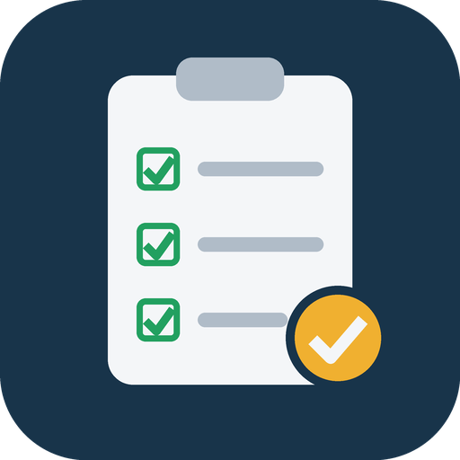

# plugin-ready



plugin-ready is a Claude Code plugin with one skill, `plugin-ready`. It gets another plugin ready for Anthropic's plugin directory. It runs a local readiness check over the plugin folder, explains each finding with its trigger and fix, and walks through fix, re-check, validate, version bump and submission.

Unofficial community plugin; not affiliated with Anthropic.

## What's inside

- **`plugin-ready` skill** (`skills/plugin-ready/SKILL.md`): the checklist and workflow.
- **Readiness check** (`skills/plugin-ready/scripts/check.mjs`): a Node script that reports each finding as BLOCK, HOLD, WARN or NOTE, matching the portal's severities, and ends with one `VERDICT:` line.
- **References**: `findings.md` (each finding's trigger and fix, with a worked example) and `readme-template.md` (a README disclosure template).

## What plugin-ready changes and touches

- **Hooks**: none. The plugin registers no hooks, no mod, no MCP server and no commands.
- **Commands it runs**: none on its own. The skill tells Claude to run `node .../check.mjs <plugin-folder>` and `claude plugin validate`, and Claude asks permission first as usual.
- **Reads**: the check script reads files in the plugin folder you point it at, and the marketplace manifest in that repository.
- **Storage**: none. The script writes no files; it prints to the terminal.
- **Network**: none.
- **Credentials**: none read. The script reads no environment variables, keychain or files under ~/.claude.

## Requirements

- Claude Code with plugin support.
- Node 22 or later for the check script. It has no dependencies.

## Install

```text
/plugin marketplace add adriancmurray/plugin-ready
/plugin install plugin-ready@plugin-ready
```

Then ask Claude to get a plugin ready for the directory, or run `/plugin-ready:plugin-ready`.

## Limitations

- The check is a heuristic built from Anthropic's published pre-submission checklist. A clean run does not guarantee a clean portal result, and the portal's scan looks for things a file check cannot see.
- The portal's rules can change; the check reflects the docs as read in October 2026.

## Layout

The plugin bundle is in `plugin/`. The repository root holds this README, the license, the marketplace manifest, `assets/`, `scripts/make-icon.py` (draws the icon with Pillow) and `tests/`.

## License

MIT. See LICENSE.
